# 1인칭 바디캠 서바이벌 호러 레벨 디자인

## 한 줄 요약

빛과 소리로 유저의 동선을 유도하고, '무력한 도주'에서 '강력한 반격'으로 이어지는 극적인 완급 조절을 통해 공포 심리를 통제한 1인칭 바디캠 호러 레벨 디자인 포트폴리오입니다.

> 시각 제한과 사운드 기반 탐색을 중심으로 설계한 1인칭 호러 레벨 디자인 프로젝트

---

## 🎮 플레이 영상

https://youtu.be/yKMXHAiV7gU

---

## 🔥 핵심 설계

* UI 없이 **빛과 소리만으로 동선을 유도하는 레벨 구조 설계**
* “무력 → 통제 → 해방”으로 이어지는 **플레이 경험 곡선 구성**
* 전투 / 회피 / 탐색이 나뉘는 **선택 기반 플레이 구조 구현**

---

## 🧩 레벨 구성

### Chapter 1 – 탐색 학습 (시각 제한)

* 바디캠 시점 + 어두운 환경으로 시야 제한
* 빛을 활용한 자연스러운 동선 유도
* 사운드 트리거 기반 긴장 빌드업

### Chapter 2 – 생존 판단 (미로 구조)

* 무적 AI를 통한 회피 중심 플레이 강제
* 전투 가능 적과 우회 경로를 통한 선택 구조 제공
* QTE 시스템을 통한 긴장 유지

### Chapter 3 – 전투 해방 (오픈 지형)

* 무기 지급을 통한 플레이 스타일 전환
* 언덕 지형 + 다중 AI 순찰 구조
* 랜드마크(빛) 기반 목표 유도

---

## ⚙️ 구현 시스템

* Surface Type 기반 **동적 발소리 시스템**
* LineTrace 기반 **지형 판별 로직**
* Anim Notify 기반 **사운드 큐 시스템**
* AI 순찰 및 감지 로직
* QTE(Quick Time Event) 시스템
* 포스트 프로세싱을 통한 바디캠 연출

---

## 📷 레벨 이미지

### Chapter 1 – 탐색 구간
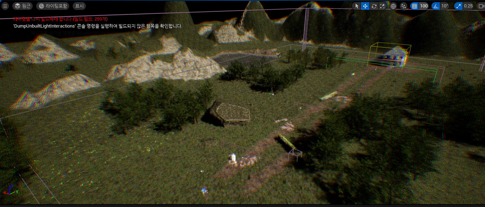
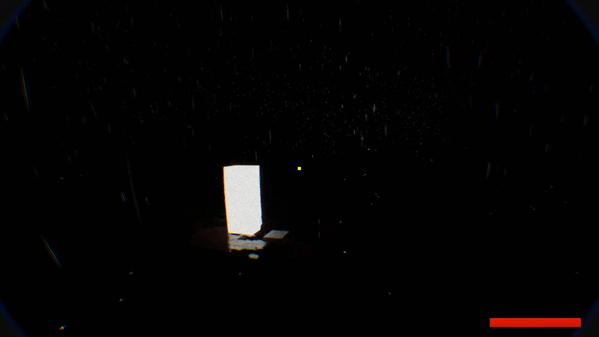
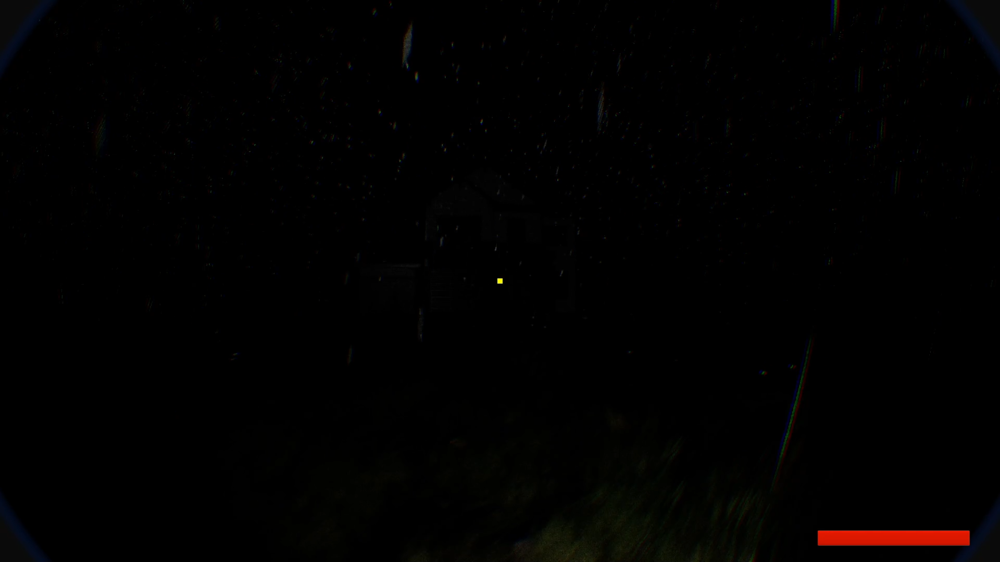
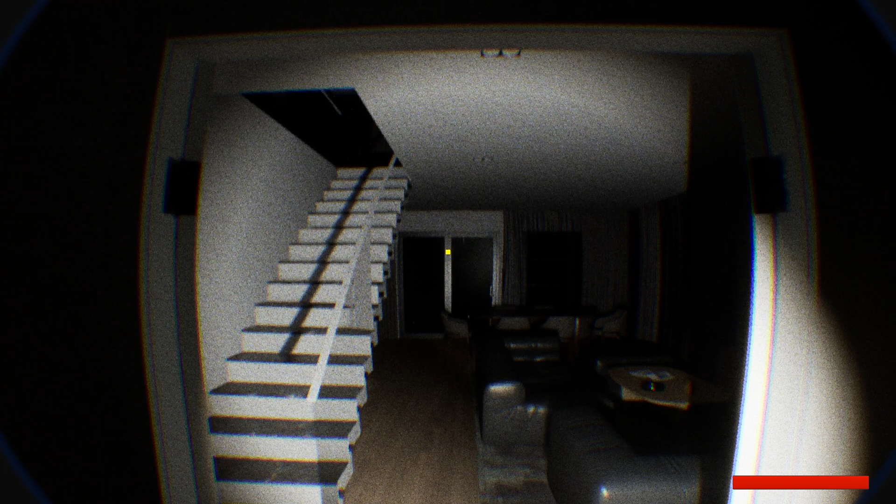

빛을 따라 이동하도록 설계된 초기 구간

### Chapter 2 – 미로 구간
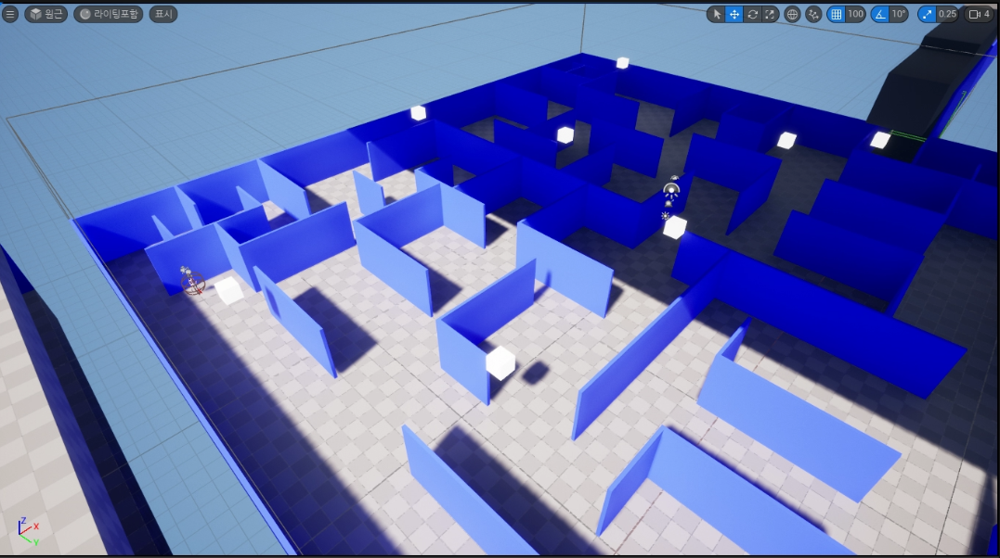
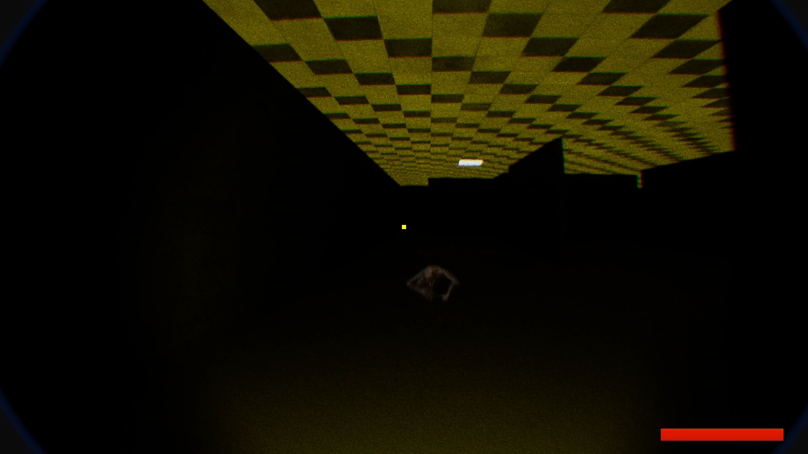
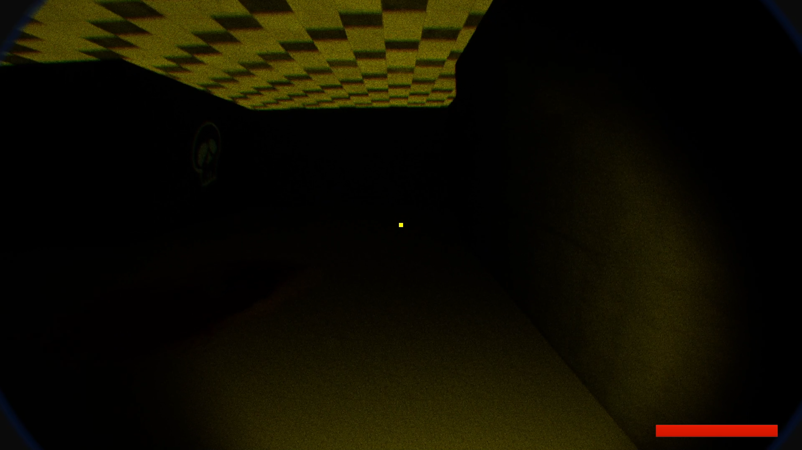
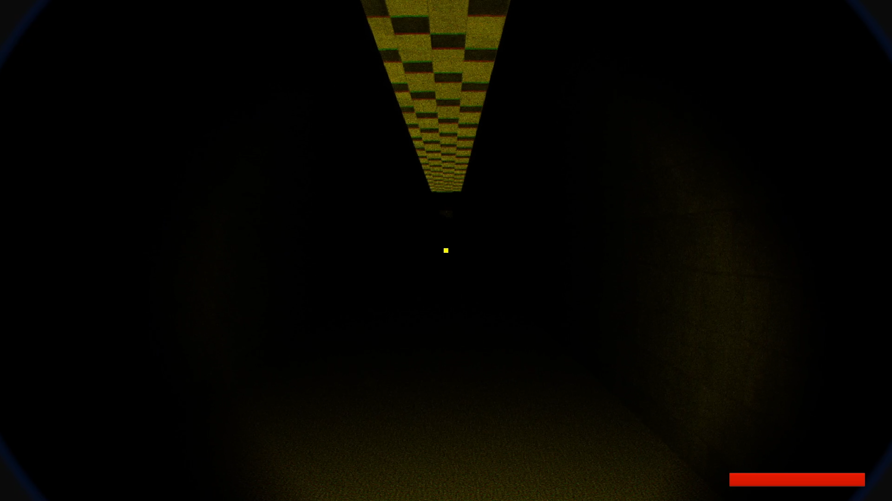
시야 제한 + 사운드 기반 탐색

### Chapter 3 – 전투 구간
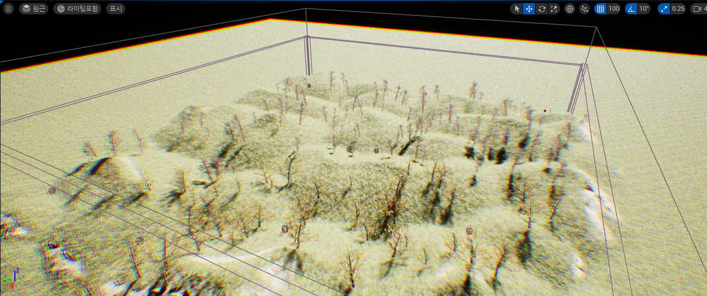
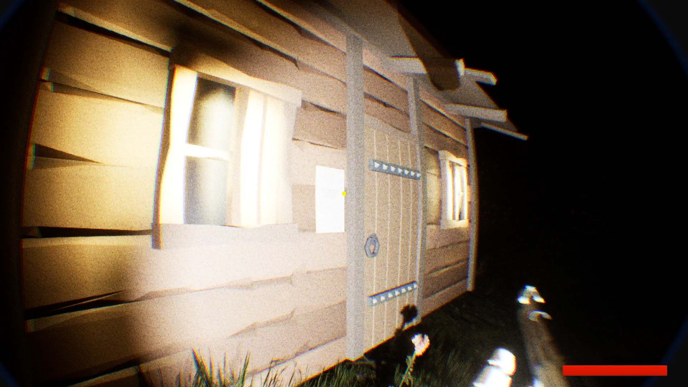
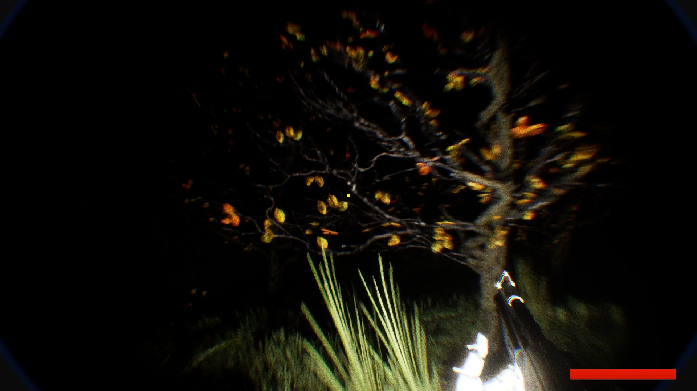
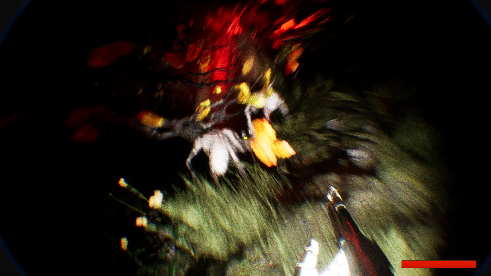
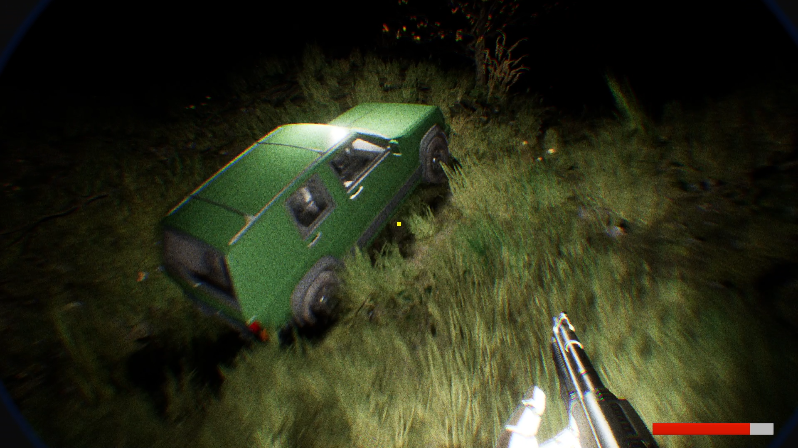

언덕 지형을 활용한 전투 설계

---

## 📊 플레이 테스트

* 플레이어는 빛을 따라 자연스럽게 이동하는 경향을 보였음  
* 미로 구간에서 방향 상실로 인해 긴장감이 크게 증가함  
* 사운드 발생 이후 주변을 탐색하는 행동이 반복적으로 관찰됨  

**결과 해석**

* 플레이어가 별도의 UI 없이도 빛을 따라 이동한 점에서 시각적 유도 설계가 효과적으로 작동한 것으로 판단  
* 미로 구간에서의 반복 이동과 정지 행동은 방향 혼란이 유도되었음을 보여주며, 의도한 긴장 상태가 형성된 것으로 해석  
* 사운드 이후 탐색 행동이 증가한 점을 통해 청각 정보가 실제 플레이 판단에 영향을 준 것으로 확인

---

## 💡 설계 포인트

* 시각 정보를 제한할 경우, 플레이어는 **청각 정보에 더 의존**
* 빛은 별도의 UI 없이도 **강력한 방향 유도 요소로 작동**
* 제한된 상태에서 해방되는 구조는 **플레이 만족도를 크게 증가시킴**

---

## 🛠️ 사용 기술

* Unreal Engine (Blueprint 기반 개발)
* LineTrace, Anim Notify
* Post Process Volume
* 간단한 AI 추적 및 순찰 로직 구현 (Blueprint 기반)

---

## 👤 제작

* 개인 프로젝트 (대학교 4학년 2학기 진행)
* 레벨 디자인, 시스템 구현, 연출 전반을 단독으로 담당
* 기획부터 구현, 폴리싱까지 전 과정 수행

---
